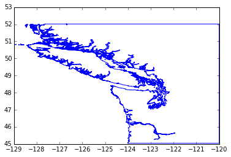
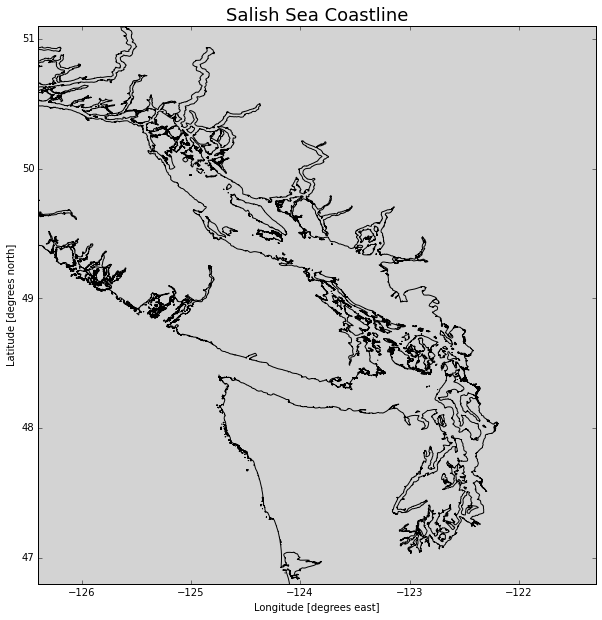
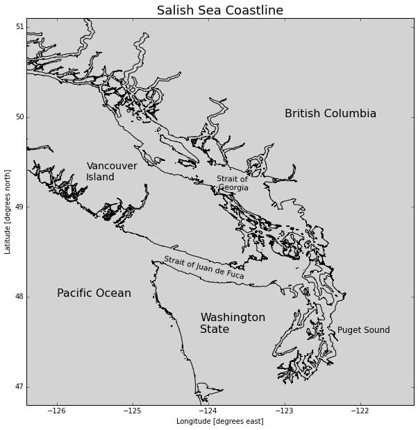
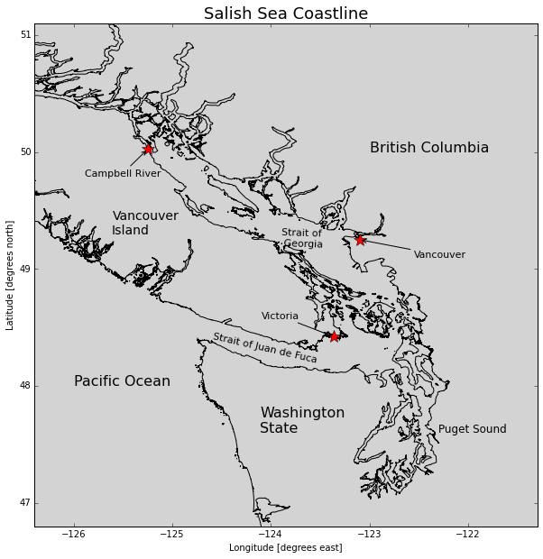

# EOAS Python - Plotting Maps

<h2 id="learning-goals">Learning Goals</h2>
<ul>
<li>List variables in a MATLAB formatted data file</li>
<li>Read MATLAB formatted data files into Python data structures</li>
<li>Create plots using <code>axes</code> objects and set various axes attributes</li>
<li>Annotate plots with text, markers, and arrows</li>
<li>Save plots to image files</li>
</ul>

<h2 id="getting-the-data">Getting the Data</h2>

<h2 id="inspecting-and-reading-.mat-files">Inspecting and Reading <code>.mat</code> Files</h2>

The <a href="http://docs.scipy.org/doc/scipy/reference/tutorial/io.html">scipy.io</a> module contains methods for inspecting MATLAB formatted data (<code>.mat</code>) files, reading them into NumPy data structures, and saving NumPy arrays as <code>.mat</code> files.

<pre>import numpy as np
import matplotlib.pyplot as plt
import scipy.io as sio

%matplotlib inline</pre>

Let's explore the Pacific Northwest coastline polygons file that Rich created from BC provincial and WA state data. Listing the variables in the file:

<pre>sio.whosmat(&#39;PNW.mat&#39;)</pre>

<pre>[(&#39;k&#39;, (13914, 1), &#39;double&#39;),
 (&#39;Area&#39;, (1, 13913), &#39;double&#39;),
 (&#39;ncst&#39;, (1470658, 2), &#39;double&#39;),
 (&#39;data_source&#39;, (16,), &#39;char&#39;)]</pre>

and loading the file into a Python varible:

<pre>pnw = sio.loadmat(&#39;PNW.mat&#39;)</pre>

Now let's see what the data looks like.

<strong>Caution</strong> Doing this can return a <em>lot</em> of output if the file is not as nicely structured as this one.

<pre>pnw</pre>

<pre>{&#39;Area&#39;: array([[  3.16521920e+01,   3.95526325e+00,   1.12423973e+01, ...,
           4.44114418e-09,   4.03697403e-09,   6.50091288e-09]]),
 &#39;__globals__&#39;: [],
 &#39;__header__&#39;: &#39;MATLAB 5.0 MAT-file, Platform: GLNXA64, Created on: Tue Sep 23 21:31:54 2014&#39;,
 &#39;__version__&#39;: &#39;1.0&#39;,
 &#39;data_source&#39;: array([u&#39;The Pacific North-West coastline in PNW.mat was created from   &#39;,
        u&#39;two sources:                                                   &#39;,
        u&#39; a) BC Freshwater Atlas Coastline (FWCSTLNSSP) available as an &#39;,
        u&#39;    Arcview shapefile from GeoBC, and                          &#39;,
        u&#39; b) WA Marine Shorelines (shore_arc), available as a shapefile &#39;,
        u&#39;    on a lambert conformal projection from WA State Dept. of   &#39;,
        u&#39;    Ecology.                                                   &#39;,
        u&#39;                                                               &#39;,
        u&#39; The WA coastline was converted to lat/long using m_map and    &#39;,
        u&#39; all island arcs were then joined into continous oriented      &#39;,
        u&#39; polygons, and the coastline itself was converted into a       &#39;,
        u&#39; polygon by the addition of inland corners.                    &#39;,
        u&#39;                                                               &#39;,
        u&#39; The result is (supposedly) on the NAD83 horizontal datum      &#39;,
        u&#39;    - Rich Pawlowicz (rich@eos.ubc.ca)                         &#39;,
        u&#39;      July/2013                                                &#39;], 
       dtype=&#39;&lt;U63&#39;),
 &#39;k&#39;: array([[      1],
        [ 396666],
        [ 639200],
        ..., 
        [1470648],
        [1470653],
        [1470658]], dtype=int32),
 &#39;ncst&#39;: array([[          nan,           nan],
        [-127.63646203,   52.0126776 ],
        [-120.        ,   52.0126    ],
        ..., 
        [-127.59785952,   50.09807875],
        [-127.59789159,   50.09793491],
        [          nan,           nan]])}</pre>

<h2 id="plotting-maps">Plotting Maps</h2>

The <code>ncst</code> variable is a 2-column collection of NaN-separated line segments that make polygons for the BC/WA coast. The line segment end points are given in longitude/latitude pairs that we can easily extract into a pair of NumPy arrays:

<pre>lats = pnw[&#39;ncst&#39;][:, 1]
lons = pnw[&#39;ncst&#39;][:, 0]</pre>

and plot:

<pre>plt.plot(lons, lats)
plt.show()</pre>

<pre>

</pre>

To really take control of plots we need to start working with <code>axes</code> objects. Here we will:

<ul>
<li>Create a larger (10 x 10) figure with 1 axes</li>
<li>Plot the coastline in black on the axes</li>
<li>Use rasterization to reduce the number of points plotted so its faster</li>
<li>Set the background colour to a light grey shade</li>
<li>Set the axes limits to zoom in to the Salish Sea</li>
<li>Add axes titles</li>
<li>Add a title to the axis in a larger font size</li>
</ul>

<pre>fig, ax = plt.subplots(1, 1, figsize=(10, 10))
ax.plot(lons, lats, color=&#39;black&#39;, rasterized=True)
ax.set_axis_bgcolor(&#39;lightgrey&#39;)
ax.set_xlim([-126.4, -121.3])
ax.set_ylim([46.8, 51.1])
ax.set_xlabel(&#39;Longitude [degrees east]&#39;)
ax.set_ylabel(&#39;Latitude [degrees north]&#39;)
ax.set_title(&#39;Salish Sea Coastline&#39;, fontsize=18)
plt.show()</pre>

<pre>

</pre>

Now, let's add some annotations:

<pre>fig, ax = plt.subplots(1, 1, figsize=(10, 10))
ax.plot(lons, lats, color=&#39;black&#39;, rasterized=True)
ax.set_axis_bgcolor(&#39;lightgrey&#39;)
ax.set_xlim([-126.4, -121.3])
ax.set_ylim([46.8, 51.1])
ax.set_xlabel(&#39;Longitude [degrees east]&#39;)
ax.set_ylabel(&#39;Latitude [degrees north]&#39;)
ax.set_title(&#39;Salish Sea Coastline&#39;, fontsize=18)
# Annotate geography
ax.text(-126, 48,&#39;Pacific Ocean&#39;, fontsize=16)
ax.text(-124.1, 47.6,&#39;Washington\nState&#39;, fontsize=16)
ax.text(-122.3, 47.6,&#39;Puget Sound&#39;, fontsize=12)
ax.text(-125.6, 49.3,&#39;Vancouver\nIsland&#39;, fontsize=14)
ax.text(-123, 50,&#39;British Columbia&#39;, fontsize=16)
ax.text(-124.6, 48.4,&#39;Strait of Juan de Fuca&#39;, fontsize=11, rotation=-13)
ax.text(-123.9, 49.2,&#39;Strait of\n Georgia&#39;, fontsize=11, rotation=-2)
plt.show()</pre>

<pre>

</pre>

Mark some of the important cities and annotate them with arrows and labels:

<pre>fig, ax = plt.subplots(1, 1, figsize=(10, 10))
ax.plot(lons, lats, color=&#39;black&#39;, rasterized=True)
ax.set_axis_bgcolor(&#39;lightgrey&#39;)
ax.set_xlim([-126.4, -121.3])
ax.set_ylim([46.8, 51.1])
ax.set_xlabel(&#39;Longitude [degrees east]&#39;)
ax.set_ylabel(&#39;Latitude [degrees north]&#39;)
ax.set_title(&#39;Salish Sea Coastline&#39;, fontsize=18)
# Annotate geography
ax.text(-126, 48,&#39;Pacific Ocean&#39;, fontsize=16)
ax.text(-124.1, 47.6,&#39;Washington\nState&#39;, fontsize=16)
ax.text(-122.3, 47.6,&#39;Puget Sound&#39;, fontsize=12)
ax.text(-125.6, 49.3,&#39;Vancouver\nIsland&#39;, fontsize=14)
ax.text(-123, 50,&#39;British Columbia&#39;, fontsize=16)
ax.text(-124.6, 48.4,&#39;Strait of Juan de Fuca&#39;, fontsize=11, rotation=-13)
ax.text(-123.9, 49.2,&#39;Strait of\n Georgia&#39;, fontsize=11, rotation=-2)
# Mark cities
cities = (
    (&#39;Victoria&#39;, -123.3657, 48.4222, -80, 20),
    (&#39;Vancouver&#39;, -123.1, 49.25, 60, -20),
    (&#39;Campbell River&#39;, -125.2475, 50.0244, -70, -30),
)
arrow_properties = {
    &#39;arrowstyle&#39;: &#39;-&gt;&#39;,
    &#39;connectionstyle&#39;: &#39;arc3, rad=0&#39;,
}
for name, lon, lat, textx, texty in cities:
    ax.plot(lon, lat, marker=&#39;*&#39;, color=&#39;red&#39;, markersize=15)
    ax.annotate(
        name, xy=(lon, lat), xytext=(textx, texty),
        textcoords=&#39;offset points&#39;, fontsize=11,
        arrowprops=arrow_properties,
    )
plt.show()</pre>

<pre>

</pre>

We can save our plot to an image file with the <code>savefig()</code> method of the figure object. Many image formats are supported, but if you can't decide, PNG is a good choice.

<pre>fig.savefig(&#39;SalishSeaGeography.png&#39;)</pre>

<h2 id="plotting-colourmaps-and-contours">Plotting Colourmaps and Contours</h2>

The coastline data above is strictly 2-dimensional. If we also have depth and/or altitude data we show that dimension via colourmaps and contour lines.

Jody Klymak at UVic has created a <code>.mat</code> file of the southern Vancouver Island coastal shelf region from the Cascadia bathymetry/topography dataset.

<pre>sio.whosmat(&#39;SouthVIgrid.mat&#39;)</pre>

<pre>[(&#39;SouthVIgrid&#39;, (1, 1), &#39;struct&#39;)]</pre>

<pre>svi = sio.loadmat(&#39;SouthVIgrid.mat&#39;)</pre>

The file structure is a little more compicated than Rich's PNW file, so we'll just use some code that Jody provided to extract the lats, lons, and elevations.

<pre>topo_struct = svi[&#39;SouthVIgrid&#39;]
topo = topo_struct[0,0]
xmask = np.where(
    np.logical_and(
        np.squeeze(topo[&#39;lon&#39;] &gt; -126.7),
        np.squeeze(topo[&#39;lon&#39;] &lt; -122)))[0]
ymask = np.where(
    np.logical_and(
        np.squeeze(topo[&#39;lat&#39;] &gt; 46),
        np.squeeze(topo[&#39;lat&#39;] &lt; 50)))[0]</pre>

<pre>x = np.squeeze(topo[&#39;lon&#39;])[xmask]
y = np.squeeze(topo[&#39;lat&#39;])[ymask]
z = topo[&#39;depth&#39;][ymask, :][:, xmask]</pre>

