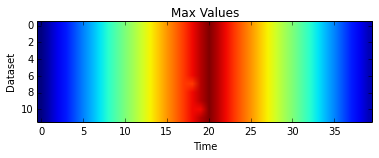
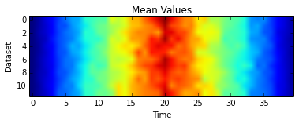

## Conditionals -- Making Choices

So we want to show that the data is &quot;cooked&quot;. This could be done lots of ways but we will do it graphically to show our supervisor.

<h4 id="objectives">Objectives</h4>
<ul>
<li>Write conditional statements including <code>if</code>, <code>elif</code>, and <code>else</code> branches.</li>
<li>Correctly evaluate expressions containing <code>and</code> and <code>or</code>.</li>
<li>Correctly write and interpret code containing nested loops and conditionals.</li>
</ul>

We will use much of what we have done in previous lessons, so lets start by importing the libraries we will use.

<pre>import glob
import numpy as np
from matplotlib import pyplot
%matplotlib inline</pre>

Now we want to read all the files, and calculate the overall statistics for each file. So we simplify our analyze function to calculate, not plot the statistics

<pre>def analyze_stats(filename):
    data = np.loadtxt(fname=filename, delimiter=&#39;,&#39;)
    return data.mean(0), data.max(0), data.min(0)</pre>

We will now set up the large arrays that we will store the statistics in. We use another method for creating numpy array: the empty function. Also available, zeros and ones.

<pre>datalen = 40
filenames = glob.glob(&#39;inflammation*.csv&#39;)
nofiles = len(filenames)
datamin = np.empty((nofiles,datalen))
datamean = np.empty_like(datamin)
datamax = np.empty_like(datamin)</pre>

Similar to the previous lesson we interate over the files and calculate the statistics for all those files. However, we want to store the information, so we count the files and use that as an index into the file. Note that datamean[count] is actually a vector, one value for each time.

Python (and most other languages in the C family) provides <a href="../../gloss.html#in-place-operator">in-place operators</a>. count += 1 add 1 to count.

<pre>count = 0
for f in filenames:
    datamean[count], datamax[count], datamin[count] = analyze_stats(f)
    count += 1</pre>

Plotting a heat map, like in the first lesson, of the maximum captures one statistic we think totally unrealistic for real data.

<pre>pyplot.imshow(datamax)
pyplot.show()</pre>

<pre>

</pre>

However, the mean is perhaps not quite as clear

<pre>pyplot.imshow(datamean)
pyplot.show()</pre>

<pre>

</pre>

So we will use line plots to show * 1) that the overall maximum is a simple straight line up and straight line back down with the same slope * 2) that almost ALL the time the maximum of a dataset is equal to the overall maximum at that time and * 3) those two maximum values that are not equal to the overall maximum are exactly one less than it

To do this we will use a conditional, imbedded inside loops.

<pre>overallmax = datamax.max(0)
pyplot.plot(overallmax)

for count in range(nofiles):
    for time in range(datalen):
        if datamax[count,time] - overallmax[time] == -1:
            pyplot.plot(time,datamax[count,time],&#39;s&#39;)
        elif datamax[count,time] &lt; overallmax[time]:
            pyplot.plot(time,datamax[count,time],&#39;x&#39;)
        else:
            pyplot.plot(time,datamax[count,time],&#39;.&#39;)
</pre>

<pre>

</pre>

One important thing to notice the code above is that we use a double equals sign <code>==</code> to test for equality rather than a single equals sign because the latter is used to mean assignment. This convention was inherited from C, and while many other programming languages work the same way, it does take a bit of getting used to...

We can also combine tests using <code>and</code> and <code>or</code>. <code>and</code> is only true if both parts are true:

<pre>if (1 &gt; 0) and (-1 &gt; 0):
    print &#39;both parts are true&#39;
else:
    print &#39;one part is not true&#39;</pre>

<pre>one part is not true
</pre>

while <code>or</code> is true if either part is true:

<pre>if (1 &lt; 0) or (&#39;left&#39; &lt; &#39;right&#39;):
    print &#39;at least one test is true&#39;</pre>

<pre>at least one test is true
</pre>

In this case, &quot;either&quot; means &quot;either or both&quot;, not &quot;either one or the other but not both&quot;.

So lets put this all in function called Sherlock and a second function plotclues

<pre>def sherlock(filenames,datalen=40):
    datamax = np.empty((len(filenames),datalen))
    count = 0
    for f in filenames:
        datamax[count] = analyze_stats(f)[1]
        count += 1
    plotclues(datamax)

def plotclues(datamax):
    overallmax = datamax.max(0)
    pyplot.plot(overallmax)
    size = datamax.shape

    for count in range(size[0]):
        for time in range(size[1]):
            if datamax[count,time] - overallmax[time] == -1:
                pyplot.plot(time,datamax[count,time],&#39;s&#39;)
            elif datamax[count,time] &lt; overallmax[time]:
                pyplot.plot(time,datamax[count,time],&#39;x&#39;)
            else:
                pyplot.plot(time,datamax[count,time],&#39;.&#39;)
    pyplot.title(&#34;Overall Maximum and Deviations Away from It\n dots = same as overall mean\n squares = exactly 1 unit less&#34;)
    pyplot.xlabel(&#34;Time (days)&#34;)
    pyplot.ylabel(&#34;Inflammation (units)&#34;)</pre>

We have made a couple of modifications to our original. * First we focus only on the maximum so we only take the second element [1] from our analyze_stats function. * Second we fix the size of our loops based on the shape of datamax. * Third we label and annotate our plot

<pre>sherlock(glob.glob(&#39;inflammation*.csv&#39;))</pre>

<pre>

</pre>

<pre></pre>

<pre></pre>

