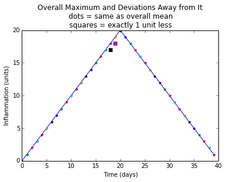
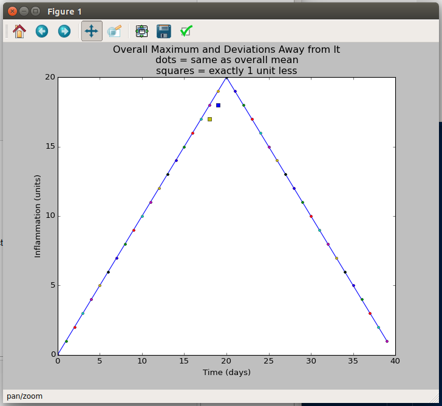

## Python Modules and Command-line Programs

The IPython Notebook and other interactive tools are great for prototyping code and exploring data, but sooner or later one or both of the following things happen:

<ul>
<li>
We develop a useful function that we want to use in other notebooks and we <em>know</em> that there has to be a better way than copying and pasting it around.
</li>
<li>
We want to use the useful function we've created in a pipeline or run via a shell script to process thousands of data files.
</li>
</ul>

In order to do reach those goals, we need to:

<ol style="list-style-type: decimal">
<li>Store our functions in a Python module</li>
<li>Put a wrapper around them to make a program that works like other Unix command-line tools</li>
</ol>

An example of a command-line script that uses our <code>sherlock()</code> function to process groups of files would look like:

<pre><code>$ python sherlock.py inflammation-*</code></pre>

or

<pre><code>$ python sherlock.py inflammation-0[6-9].csv</code></pre>

To make this work, we need to know how to handle command-line arguments in a program, and how to get at <a href="../../gloss.html#standard-input">standard input</a>.

<h4 id="objectives">Objectives</h4>
<ul>
<li>Create a Python module containing functions that can be <code>import</code>-ed into notebooks and other modules.</li>
<li>Use the values of command-line arguments in a program.</li>
<li>Read data from standard input in a program so that it can be used in a pipeline.</li>
</ul>

### Python Modules

A Python module is just a text file that contains some Python functions. Once we have our functions in a module we can use the <code>import</code> statement to bring them into any number of iPython Notebooks, or into other Python modules.

So, let's put our <code>sherlock()</code> and <code>plot_clues()</code> functions into a text file called <code>sherlock.py</code>. We could:

<ol style="list-style-type: decimal">
<li>Open an empty file called <code>sherlock.py</code> in our favourite text editor and type the functions again</li>
<li>Use copy and paste to scoop the functions from the <a href="http://nbviewer.ipython.org/github/douglatornell/2014-09-25-ubc/blob/gh-pages/novice/python/04-simple_cond.ipynb"><code>04-simple_cond</code></a> notebook into the file</li>
<li>Use the iPython Notebook <code>%%writefile</code> cell magic to write the functions out of the notebook into the file</li>
</ol>

We'll use <code>%%writefile</code> because it's the least work.

<pre>%%writefile?</pre>

<pre><code>Type:        Magic function
String form: &lt;bound method OSMagics.writefile of &lt;IPython.core.magics.osm.OSMagics object at 0x7fa01a2926d0&gt;&gt;
Namespace:   IPython internal
File:        /home/dlatornell/anaconda3/envs/swc/lib/python2.7/site-packages/IPython/core/magics/osm.py
Definition:  %%writefile(self, line, cell)
Docstring:
::

  %writefile [-a] filename

Write the contents of the cell to a file.

The file will be overwritten unless the -a (--append) flag is specified.

positional arguments:
  filename      file to write

optional arguments:
  -a, --append  Append contents of the cell to an existing file. The file will
                be created if it does not exist.</code></pre>

To write our <code>sherlock()</code> and <code>plot_clues()</code> functions to a Python module files called <code>sherlock.py</code> put

<pre><code>%%writefile sherlock.py</code></pre>

at the top of the cell containing the functions and execute the cell. The results message will tell us that the contents of the cell have been written to a file instead of having been executed.

Don't forget to delete the <code>%%writefile</code> line from the top of the cell before you save the notebook.

We also need the <code>analyze_stats()</code> function because <code>sherlock()</code> calls that too. Use

<pre><code>%%writefile -a sherlock.py</code></pre>

to append it to our <code>sherlock.py</code> module.

When we're done <code>sherlock.py</code> should contain:

<pre>!cat sherlock.py</pre>

<pre>def sherlock(filenames, datalen=40):
    datamax = np.empty((len(filenames), datalen))
    count = 0
    for f in filenames:
        datamax[count] = analyze_stats(f)[1]
        count += 1
    plot_clues(datamax)

    
def plot_clues(datamax):
    overallmax = datamax.max(0)
    plt.plot(overallmax)
    size = datamax.shape

    for count in range(size[0]):
        for time in range(size[1]):
            if datamax[count, time] - overallmax[time] == -1:
                plt.plot(time, datamax[count, time], &#39;s&#39;)
            elif datamax[count, time] &lt; overallmax[time]:
                plt.plot(time, datamax[count, time], &#39;x&#39;)
            else:
                plt.plot(time, datamax[count, time], &#39;.&#39;)
    plt.title(
        &#34;Overall Maximum and Deviations Away from It\n&#34;
        &#34;dots = same as overall mean\n&#34;
        &#34;squares = exactly 1 unit less&#34;)
    plt.xlabel(&#34;Time (days)&#34;)
    plt.ylabel(&#34;Inflammation (units)&#34;)def analyze_stats(filename):
    data = np.loadtxt(fname=filename, delimiter=&#39;,&#39;)
    return data.mean(0), data.max(0), data.min(0)</pre>

Now that we have our code in a text file we'll shift to our favourite text editor to make changes.

The first thing we need to do is import the modules that <code>sherlock()</code> and <code>plot_clues()</code> use.

In your editor, add the following lines to the top of the file, and save it.

<pre class="sourceCode python"><code class="sourceCode python">import matplotlib.pyplot as plt
import numpy as np</code></pre>

By convention, imports are written in alphabetical order.

We also need to fix how the definition of <code>analyze_stats()</code> was appended to the file by adding a couple of empty lines and making sure that the indentation is correct.

After doing those things <code>sherlock.py</code> should look like:

<pre>!cat sherlock.py</pre>

<pre>import numpy as np
import matplotlib.pyplot as plt

def sherlock(filenames, datalen=40):
    datamax = np.empty((len(filenames), datalen))
    count = 0
    for f in filenames:
        datamax[count] = analyze_stats(f)[1]
        count += 1
    plot_clues(datamax)

def plot_clues(datamax):
    overallmax = datamax.max(0)
    plt.plot(overallmax)
    size = datamax.shape

    for count in range(size[0]):
        for time in range(size[1]):
            if datamax[count, time] - overallmax[time] == -1:
                plt.plot(time, datamax[count, time], &#39;s&#39;)
            elif datamax[count, time] &lt; overallmax[time]:
                plt.plot(time, datamax[count, time], &#39;x&#39;)
            else:
                plt.plot(time, datamax[count, time], &#39;.&#39;)
    plt.title(
        &#34;Overall Maximum and Deviations Away from It\n&#34;
        &#34;dots = same as overall mean\n&#34;
        &#34;squares = exactly 1 unit less&#34;)
    plt.xlabel(&#34;Time (days)&#34;)
    plt.ylabel(&#34;Inflammation (units)&#34;)

def analyze_stats(filename):
    data = np.loadtxt(fname=filename, delimiter=&#39;,&#39;)
    return data.mean(0), data.max(0), data.min(0)
</pre>

Now, we can import our <code>sherlock()</code> function and use it just in this notebook just like we used it in the previous notebook where we developed it:

<pre>%matplotlib inline

import glob

import sherlock

sherlock.sherlock(glob.glob(&#39;inflammation-*.csv&#39;))</pre>

<pre>

</pre>

### Docstrings

Let's add some docstrings to our module and its functions to tell our future selves and others what the code does. Recall the the convention for docstrings is to enclose them in sets of triple double quotes: <code>&quot;&quot;&quot;</code>. The module docstring goes at the top of the module (before the imports), and the function docstrings go at the tops of the functions (just after the <code>def</code> statements).

Once we have some docstring in our module we can reload it into the notebook and use the help features to check them out.

<pre>reload(sherlock)</pre>

<pre>&lt;module &#39;sherlock&#39; from &#39;sherlock.pyc&#39;&gt;</pre>

<blockquote>
<h4>Reload?</h4>

The import statement only works once during a Python session. After that, Python will not reread your code, no matter how many times you import it. This means that if you import your code from a file, then change and save the file, those changes won't be reflected in Python, even if you <code>import</code> your module again. To explicitly force Python to reread your module after a change, use the <code>reload()</code> function.

</blockquote>

<pre>sherlock?</pre>

<pre><code>Type:        module
String form: &lt;module &#39;sherlock&#39; from &#39;sherlock.pyc&#39;&gt;
File:        /home/dlatornell/swc/2014-09-25-ubc/novice/python/sherlock.py
Docstring:
Investigate the suspicious similarities in the inflammation data files.

Plot a graph that shows how little the per-dataset maximum inflammation
deviates from the overal maximum value.</code></pre>

<pre>sherlock.sherlock?</pre>

<pre><code>Type:        function
String form: &lt;function sherlock at 0x7f303dde68c0&gt;
File:        /home/dlatornell/swc/2014-09-25-ubc/novice/python/sherlock.py
Definition:  sherlock.sherlock(filenames, datalen=40)
Docstring:
Detect the suspicious lack of differences in the maximum
inflamation values.</code></pre>

### Command-Line Arguments

Use your editor to create a new file called <code>argv-list.py</code> that contains the lines:

<pre class="sourceCode python"><code class="sourceCode python">import sys
print &#39;sys.argv is&#39;, sys.argv</code></pre>

That strange name <code>argv</code> stands for &quot;argument values&quot;. Whenever Python runs a program, it takes all of the values given on the command line and puts them in the list <code>sys.argv</code> so that the program can determine what they were.

If we use Python to run this program at the command-line:

<pre><code>$ python argv-list.py</code></pre>

The output should look something like:

<pre><code>sys.argv is [&#39;argv-list.py&#39;]</code></pre>

and if we run it from a different directory, we get:

<pre><code>$ cd ..
$ python hbridge/argv-list.py
sys.argv is [&#39;hbridge/argv-list.py&#39;]</code></pre>

The only thing in the list is the path to our script, which is always <code>sys.argv[0]</code>. If we run it with a few arguments, however:

<pre><code>$ python hbridge/argv-list.py one two three
sys.argv is [&#39;hbridge/argv-list.py&#39;, &#39;one&#39;, &#39;two&#39;, &#39;three&#39;]</code></pre>

then Python adds each of those arguments to the list.

With that knowledge we can add a feature to our <code>sherlock.py</code> module to enable us to run <code>sherlock</code> from the command-line and pass in the list of files that we want it to operate on via shell wildcard characters.

In your text editor, add

<pre class="sourceCode python"><code class="sourceCode python">import sys</code></pre>

to the collection of import statements at the top of the <code>sherlock.py</code> file, and add a new function definition:

<pre class="sourceCode python"><code class="sourceCode python">def main():
    &quot;&quot;&quot;Command-line interface.
    &quot;&quot;&quot;
    script = sys.argv[0]
    files = sys.argv[1:]
    for fn in files:
        print fn</code></pre>

The <code>main()</code> function is the function that we're going to call when the module is executed by Python from the command-line. It's a Python convention to call it <code>main()</code>, but you could call it anything else if you wanted to. At this point <code>main()</code> is just a &quot;stub&quot; for testing - it doesn't call <code>sherlock()</code> yet, but we'll get there...

We need to call the <code>main()</code> when we do:

<pre class="sourceCode bash"><code class="sourceCode bash">$ python sherlock.py</code></pre>

but we also want to still be able to use:

<pre class="sourceCode python"><code class="sourceCode python">import sherlock</code></pre>

in our code as we did a few minutes ago. There is a detail that we need to take care of for things to work both ways.

When Python imports a module it executes the code in the module. If we just put a call to <code>main()</code> in <code>sherlock.py</code> it will be executed whenever we do <code>import sherlock</code>, perhaps with unpleasant (or unexpected) results. That's what's known as an &quot;import side-effect&quot; and it's bad form in Python programming. Fortunately, Python provides a way to solve this problem. There is a special variable, <code>__name__</code>, which is set when Python reads a module. If Python is reading the module because it has been run from the command-line, <code>__name__</code> is set to <code>&quot;__main__&quot;</code>, but if the module is being read because it is being imported, <code>__name__</code> is set to the name of the module.

We can use that to ensure that our <code>main()</code> function is only executed when the module is run at the command-line by adding these 2 lines of code to the end of <code>sherlock.py</code>:

<pre class="sourceCode python"><code class="sourceCode python">if __name__ == &#39;__main__&#39;:
    main()</code></pre>

With those changes in place, here's what <code>sherlock.py</code> looks like now:

<pre>!cat sherlock.py</pre>

<pre>&#34;&#34;&#34;Investigate the suspicious similarities in the inflammation data files.

Plot a graph that shows how little the per-dataset maximum inflammation
deviates from the overal maximum value.
&#34;&#34;&#34;
import sys

import numpy as np
import matplotlib.pyplot as plt

def main():
    &#34;&#34;&#34;Command-line interface.
    &#34;&#34;&#34;
    script = sys.argv[0]
    files = sys.argv[1:]
    for fn in files:
        print fn

def sherlock(filenames, datalen=40):
    &#34;&#34;&#34;Detect the suspicious lack of differences in the maximum
    inflamation values.
    &#34;&#34;&#34;
    datamax = np.empty((len(filenames), datalen))
    count = 0
    for f in filenames:
        datamax[count] = analyze_stats(f)[1]
        count += 1
    plot_clues(datamax)

def plot_clues(datamax):
    overallmax = datamax.max(0)
    plt.plot(overallmax)
    size = datamax.shape

    for count in range(size[0]):
        for time in range(size[1]):
            if datamax[count, time] - overallmax[time] == -1:
                plt.plot(time, datamax[count, time], &#39;s&#39;)
            elif datamax[count, time] &lt; overallmax[time]:
                plt.plot(time, datamax[count, time], &#39;x&#39;)
            else:
                plt.plot(time, datamax[count, time], &#39;.&#39;)
    plt.title(
        &#34;Overall Maximum and Deviations Away from It\n&#34;
        &#34;dots = same as overall mean\n&#34;
        &#34;squares = exactly 1 unit less&#34;)
    plt.xlabel(&#34;Time (days)&#34;)
    plt.ylabel(&#34;Inflammation (units)&#34;)
    plt.show()

def analyze_stats(filename):
    data = np.loadtxt(fname=filename, delimiter=&#39;,&#39;)
    return data.mean(0), data.max(0), data.min(0)

if __name__ == &#39;__main__&#39;:
    main()
</pre>

Let's test it!

<pre class="sourceCode bash"><code class="sourceCode bash">$ python sherlock.py inflammation-01.csv 
inflammation-01.csv</code></pre>

<pre class="sourceCode bash"><code class="sourceCode bash">$ python sherlock.py inflammation-*.csv 
inflammation-01.csv
inflammation-02.csv
inflammation-03.csv
inflammation-04.csv
inflammation-05.csv
inflammation-06.csv
inflammation-07.csv
inflammation-08.csv
inflammation-09.csv
inflammation-10.csv
inflammation-11.csv
inflammation-12.csv</code></pre>

<pre class="sourceCode bash"><code class="sourceCode bash">$ python sherlock.py inflammation-0[6-9].csv 
inflammation-06.csv
inflammation-07.csv
inflammation-08.csv
inflammation-09.csv</code></pre>

As expected, <code>sherlock.py</code> is printing out the list of files that we are asking for with the shell wildcard characters. So, it's just a small change now to call the <code>sherlock()</code> function on that list:

<pre class="sourceCode python"><code class="sourceCode python">def main():
    &quot;&quot;&quot;Command-line interface.
    &quot;&quot;&quot;
    script = sys.argv[0]
    files = sys.argv[1:]
    sherlock(files)</code></pre>

Now, when we run

<pre class="sourceCode bash"><code class="sourceCode bash">$ python sherlock.py inflammation-*.csv</code></pre>

a Matplotlib graph window pops open:

matplotlib graph window

It has tool buttons to let you pan and zoom in the image, and also to save the image to a file.

In summary:

<ul>
<li>We started with some functions that we developed in a <a href="http://nbviewer.ipython.org/github/douglatornell/2014-09-25-ubc/blob/gh-pages/novice/python/04-simple_cond.ipynb"><code>notebook</code></a> but that we decided we wanted to use elsewhere.</li>
<li>We captured those functions in a Python module (<code>sherlock.py</code>) with the help of the IPython Notebook <code>%%writefile</code> cell magic.</li>
<li>We modified the module in a text editor to add imports and docstrings.</li>
<li>We demonstrated that we could import from our <code>sherlock.py</code> module, and use the help features of IPython to read our docstrings.</li>
<li>We modified <code>sherlock.py</code> so that it could be used as a command-line script as well as an import.</li>
<li>We used the <code>sherlock()</code> function to produce graphs both in-line in an IPython Notebook, and in a separate graph window.</li>
</ul>

This is an example of code re-use and the DRY (Don't Repeat Yourself) principle. We developed <code>sherlock()</code> and its associated functions in one context and made them useful in other ways without having to copy/paste them and maintain multiple versions.

### Connecting to the Pipeline

Although it doesn't make much sense in the context of <code>sherlock</code>, you can probably imagine wanting to write a Python script that you could use as part of a shell pipeline:

<pre class="sourceCode bash"><code class="sourceCode bash">$ python myscript.py &lt; inflammation-*.csv | head -20</code></pre>

Python provides a special &quot;file&quot; called <code>sys.stdin</code>, which is automatically connected to the program's standard input. We don't have to open it — Python and the operating system take care of that when the program starts up — but we can do almost anything with it that we could do to a regular file.

We can use that in a <code>main()</code> function like this:

<pre class="sourceCode python"><code class="sourceCode python">def main():
    script = sys.argv[0]
    filenames = sys.argv[1:]
    if not filenames:
        process(sys.stdin)
    else:
        process(filenames)</code></pre>

### Argparse

Creating command-line scripts with multiple arguments, option flags, built-in help, etc. is a common enough task that people have written Python libraries to take care of most of the tedious details. The Python standard library has a module named <a href="http://docs.python.org/dev/library/argparse.html">argparse</a> that does that. When you want to get serious about creating Python command-line scripts you should go to Tshepang Lekhonkhobe's <a href="http://docs.python.org/dev/howto/argparse.html">Argparse tutorial</a> that is part of Python's Official Documentation.

<h3 id="key-points">Key Points</h3>
<ul>
<li>A Python module is a text file containing Python code.</li>
<li><code>%%writefile</code> lets you output code developed in a Notebook to a Python module.</li>
<li>The <code>sys</code> library connects a Python program to the system it is running on.</li>
<li>The list <code>sys.argv</code> contains the command-line arguments that a program was run with.</li>
<li><code>if __name__ == &quot;__main__&quot;:</code> provides a shield that prevents code in a module from being executed when the module is imported, but allows it to be run from the command-line.</li>
<li>The &quot;file&quot; <code>sys.stdin</code> connects to a program's standard input.</li>
</ul>

